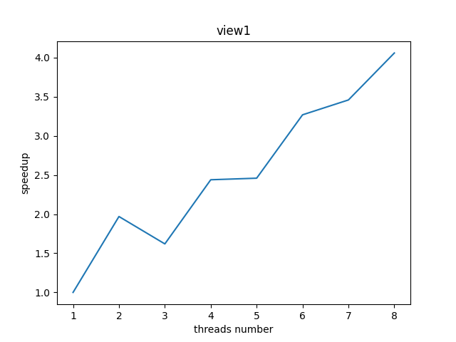
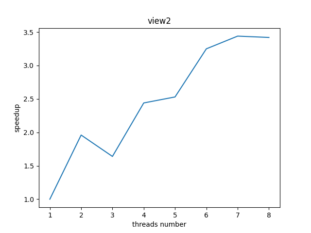

# assignment 1
## program 1

1. implement `workerThreadStart(WorkerArgs * const args)` in *mandelbrotThread.cpp*
```cpp
void workerThreadStart(WorkerArgs * const args) {

    // TODO FOR CS149 STUDENTS: Implement the body of the worker
    // thread here. Each thread should make a call to mandelbrotSerial()
    // to compute a part of the output image.  For example, in a
    // program that uses two threads, thread 0 could compute the top
    // half of the image and thread 1 could compute the bottom half.

    printf("Hello world from thread %d\n", args->threadId);
    int width = args->width, height = args->height;
    int numRows = height / args->numThreads;
    int startRow = args->threadId * numRows;

    if (startRow + 2 * numRows  > height) numRows = height - startRow;

    mandelbrotSerial(
        args->x0, args->y0, args->x1, args->y1,
        width, height, 
        startRow, numRows,
        args->maxIterations,
        args->output
    );
}
```
2. plot speedup with respect to number of threads


It is not speedup linear in the number of threads used.Maybe the reason is unbalanced workload.

3. add some code in `workerThreadStart(WorkerArgs * const args)`
```cpp
void workerThreadStart(WorkerArgs * const args) {

    auto begin = CycleTimer::currentSeconds();

    int width = args->width, height = args->height;
    int numRows = height / args->numThreads;
    int startRow = args->threadId * numRows;

    if (startRow + 2 * numRows  > height) numRows = height - startRow;

    mandelbrotSerial(
        args->x0, args->y0, args->x1, args->y1,
        width, height, 
        startRow, numRows,
        args->maxIterations,
        args->output
    );

    auto end = CycleTimer::currentSeconds();

    printf("thread %d cost %lf ms\n", args->threadId, (end - begin) * 1000);
}
```

measurements:
```sh
thread 2 cost 48.383185 ms
thread 0 cost 50.272677 ms
thread 1 cost 153.270911 ms
[mandelbrot thread]:            [153.428] ms
Wrote image file mandelbrot-thread.ppm
                                (1.64x speedup from 3 threads)
```

So, it turns out that there is unbalanced workload.

4. from blocked decomposition to interleaved decomposition
```cpp
void workerThreadStart(WorkerArgs * const args) {

    // auto begin = CycleTimer::currentSeconds();

    int width = args->width, height = args->height;
    int numRows = 1;
    int startRow = args->threadId;

    for (int row = startRow; row < height; row += args->numThreads){
        mandelbrotSerial(
            args->x0, args->y0, args->x1, args->y1,
            width, height, 
            row, numRows,
            args->maxIterations,
            args->output
        );
    }

    // auto end = CycleTimer::currentSeconds();

    // printf("thread %d cost %lf ms\n", args->threadId, (end - begin) * 1000); 
    // printf is costly.

}
```
> **NOTICE: Remove `printf` !**

5. there is almost no improve on 8-cores machines when it goes to 16 threads.However it may improve on machines which have more than 8 cores.

## program2

