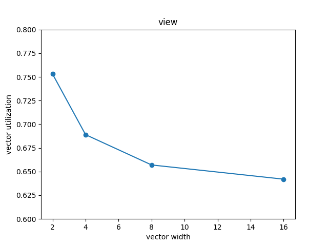

# assignment 1
## program 2
1.  Implement a vectorized version of `clampedExpSerial` in `clampedExpVector` . Your implementation 
should work with any combination of input array size (`N`) and vector width (`VECTOR_WIDTH`). 
```cpp
void clampedExpVector(float* values, int* exponents, float* output, int N) {

  //
  // CS149 STUDENTS TODO: Implement your vectorized version of
  // clampedExpSerial() here.
  //
  // Your solution should work for any value of
  // N and VECTOR_WIDTH, not just when VECTOR_WIDTH divides N
  //

  __cs149_vec_float v;
  __cs149_vec_int e;
  __cs149_vec_float res;

  __cs149_vec_int zero = _cs149_vset_int(0);
  __cs149_vec_int one = _cs149_vset_int(1);
  __cs149_vec_float ceil = _cs149_vset_float(9.999999f);
  __cs149_vec_int count;

  __cs149_mask maskAll, maskCountGtZero, maskValueGtCeil;

  for (int i = 0; i < N; i += VECTOR_WIDTH){
    int width = min(VECTOR_WIDTH, N - i);
    maskAll = _cs149_init_ones(width); // all ones;
    count = _cs149_vset_int(0); // all zeros;

    _cs149_vset_float(res, 1.f, maskAll);                   // res = 1.0;
    _cs149_vload_float(v, values + i, maskAll);
    _cs149_vload_int(e, exponents + i, maskAll);

    _cs149_vload_int(count, exponents + i, maskAll);
    _cs149_vgt_int(maskCountGtZero, count, zero, maskAll);

    while (_cs149_cntbits(maskCountGtZero)) {                       // while (exp > 0) {
      _cs149_vmult_float(res, res, v, maskCountGtZero);             //  res *= values;
      _cs149_vsub_int(count, count, one, maskCountGtZero);          //  exp -= 1;
      _cs149_vgt_float(maskValueGtCeil, res, ceil, maskAll);        //  if (res > 9.999999)
      _cs149_vmove_float(res, ceil, maskValueGtCeil);               //    res = 9.999999;
      _cs149_vgt_int(maskCountGtZero, count, zero, maskCountGtZero);// }
    }
    _cs149_vstore_float(output + i, res, maskAll);
  }
}
```

2.  Run `./myexp -s 10000` and sweep the vector width from 2, 4, 8, to 16. Record the resulting vector 
utilization. You can do this by changing the `#define VECTOR_WIDTH` value in `CS149intrin.h`. 
Does the vector utilization increase, decrease or stay the same as `VECTOR_WIDTH` changes? Why?

- ljh@ljh-virtual-machine:~/asst1/prog2_vecintrin$ ./myexp -s 10000  
CLAMPED EXPONENT (required)   
Results matched with answer!  
****************** Printing Vector Unit Statistics *******************  
Vector Width:              2  
Total Vector Instructions: 223771  
Vector Utilization:        75.3%  
Utilized Vector Lanes:     336812  
Total Vector Lanes:        447542  
************************ Result Verification *************************  
Passed!!!  
- ljh@ljh-virtual-machine:~/asst1/prog2_vecintrin$ ./myexp -s 10000  
CLAMPED EXPONENT (required)   
Results matched with answer!  
****************** Printing Vector Unit Statistics *******************  
Vector Width:              4  
Total Vector Instructions: 131855  
Vector Utilization:        68.9%  
Utilized Vector Lanes:     363442  
Total Vector Lanes:        527420  
************************ Result Verification *************************  
Passed!!!  
- ljh@ljh-virtual-machine:~/asst1/prog2_vecintrin$ ./myexp -s 10000  
CLAMPED EXPONENT (required)   
Results matched with answer!  
****************** Printing Vector Unit Statistics *******************  
Vector Width:              8  
Total Vector Instructions: 72439  
Vector Utilization:        65.7%  
Utilized Vector Lanes:     380814  
Total Vector Lanes:        579512  
************************ Result Verification *************************  
Passed!!!  
- ljh@ljh-virtual-machine:~/asst1/prog2_vecintrin$ ./myexp -s 10000  
CLAMPED EXPONENT (required)   
Results matched with answer!  
****************** Printing Vector Unit Statistics *******************  
Vector Width:              16  
Total Vector Instructions: 37949  
Vector Utilization:        64.2%  
Utilized Vector Lanes:     390054  
Total Vector Lanes:        607184  
************************ Result Verification *************************  
Passed!!!  

- plot:
> 
- The vector utilization decrease, because conditional statement will complicate the lanes flow.

3.  _Extra credit: (1 point)_ Implement a vectorized version of `arraySumSerial` in `arraySumVector`. Your implementation may assume that `VECTOR_WIDTH` is a factor of the input array size `N`. Whereas the serial implementation runs in `O(N)` time, your implementation should aim for runtime of `(N / VECTOR_WIDTH + VECTOR_WIDTH)` or even `(N / VECTOR_WIDTH + log2(VECTOR_WIDTH))`  You may find the `hadd` and `interleave` operations useful.

***RESERVE***